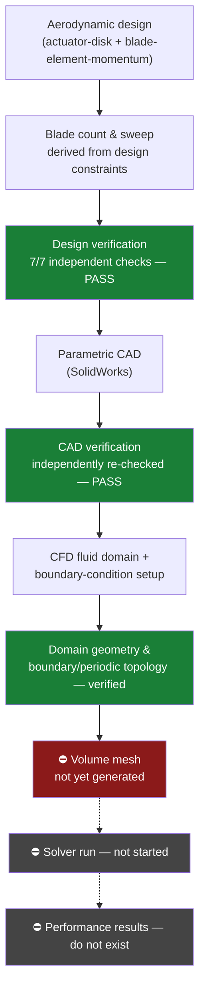
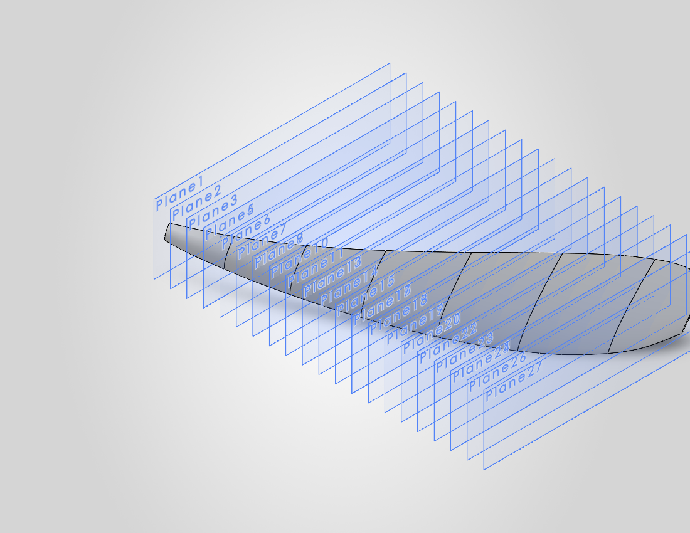

# Boeing Open-Fan Rotor — Aerodynamic Design and Verified CAD

**A swept open-fan rotor blade, designed from first principles for the tip-compressibility
problem an unducted architecture reintroduces, built as fully parametric CAD, and independently
verified at every completed stage.** This is not a downloaded or hand-modeled CAD file, every
dimension traces back through a script to a governing equation.

**Stack:** SolidWorks 2026 · ANSYS Fluent 2025 R1 Python · (NumPy/SciPy)

---

## Objective

Open-fan (unducted) propulsion is back under serious consideration because bypass ratio, the
main lever on propulsive efficiency, is running out of room inside a conventional ducted
nacelle. Removing the duct raises efficiency further but reopens a classical problem: the blade
tip now sees a **supersonic relative flow condition** even at a modest flight Mach, and blade
**sweep**, rather than a duct, becomes the primary tool for managing it, as it did in 1980s
advanced turboprop programs. This project designs, builds, and verifies a rotor blade around
exactly that problem.

## Engineering approach

The blade was sized aerodynamically from first principles, with blade count and sweep angle
treated as **outputs** of governing constraints rather than assumed inputs. The design was then
built as fully parametric CAD and independently re-verified, and a CFD domain was constructed and
verified in preparation for a subsequent analysis.



*How each stage was verified — including the CAD construction failure that was diagnosed and
recovered from, and the specific method used to confirm CFD boundary/periodic topology — is
technical follow-up detail, not a landing-page summary. See "Technical evidence" below.*

## Key verified outcomes



| Quantity | Value | Note |
|---|---|---|
| Blade count | **16** | *output* of a solidity/aspect-ratio trade — not assumed |
| Tip sweep | **44.66°** | *derived* from a compressibility constraint at the blade tip, not assumed or copied from a reference design |
| Helical tip Mach | **1.10** (supersonic, relative frame) | the quantity that actually governs tip-section compressibility |
| Aerodynamic design verification | **PASS** | 7/7 independent closure checks |
| CAD geometry verification | **PASS** | independently re-verified in a separate process |
| CFD domain + boundary topology | **Verified** | domain volume and boundary/periodic connectivity independently confirmed |

Full design-output table and figures: [`01_design/results/`](01_design/results/).

## Current maturity

| Stage | Status |
|---|---|
| Aerodynamic design (BEM, gate G0) | ✅ **PASS** — 7/7 independent checks |
| Parametric CAD (gate G1) | ✅ **PASS** — independently re-verified in a separate process |
| CFD fluid-domain geometry | ✅ verified — volume matches analytic expectation to 0.0006% |
| CFD boundary/periodic topology | ✅ verified — independent inspection of the saved mesh file |
| CFD volume mesh | ⛔ not yet generated |
| CFD solver run | ⛔ not started |
| CFD performance results | ⛔ **do not exist** |
| Experimental validation | ⛔ not attempted |
| Installed configuration | ⛔ not attempted |

**No CFD solution, thrust/power number, or performance claim exists anywhere in this repository.**

## Technical evidence

This README states the outcome; the following documents carry the derivation, construction, and
verification detail for anyone who wants to go deeper:

| Document | What it contains |
|---|---|
| [`EVIDENCE_INDEX.md`](EVIDENCE_INDEX.md) | Every claim in this repository, its evidence artifact, and its verification method — start here for "how do I know this is true" |
| [`reports/BOEING_OPEN_FAN_FINAL_REPORT.md`](reports/BOEING_OPEN_FAN_FINAL_REPORT.md) | The full technical report — design equations, CAD construction, CFD preprocessing methodology |
| [`reports/BOEING_OPEN_FAN_PROJECT_REPORT.md`](reports/BOEING_OPEN_FAN_PROJECT_REPORT.md) | Extended report with the full verification hierarchy and continuation plan |
| [`02_cad/CAD_CHECK2_DIAGNOSTIC.md`](02_cad/CAD_CHECK2_DIAGNOSTIC.md), [`02_cad/failure_history/`](02_cad/failure_history/) | The first CAD construction attempt failed its own verification gate; this is the root-cause diagnosis and the documented recovery, kept visible rather than hidden |
| [`03_cfd/CFD_STATUS.md`](03_cfd/CFD_STATUS.md) | Detailed CFD-stage status, including how boundary/periodic topology was independently verified |

## Current limitations

- No volume mesh, solver run, or CFD-derived performance number exists.
- No experimental or published-benchmark validation has been attempted.
- No installed (wing-integrated) configuration exists.
- The 16-blade full-rotor CAD assembly is deferred, a SolidWorks installation-level limitation,
  not required for the CFD domain, which only needs the single-blade periodic sector.
- The hub is modeled as a plain cylinder; the spinner fairing is not yet built.

## Repository structure

```
public_repo/
├── README.md
├── PROJECT_STATUS.md                    resume point / current blocker / next command
├── EVIDENCE_INDEX.md                    every claim -> artifact -> verification method
├── EXPLORATORY_HISTORY_NOTE.md          what was left out of this curated repo, and why
├── reports/                             final report, extended report, figure map, phase reports
├── figures/                             curated evidence figures + regeneration scripts
├── 00_requirements/                     Phase 0 research, requirements, decision log
├── 01_design/                           BEM aerodynamic design (openfan_design.py) + results
├── 02_cad/                              parametric SolidWorks CAD — v02 (verified master),
│                                         verification scripts/records, failure_history/ (v01)
└── 03_cfd/
    ├── geometry/                        fluid-domain derivative CAD + verification
    ├── zone_definition/                 classified/verified boundary mesh + records
    ├── mesh/                            mesh specification (targets, not yet executed)
    ├── setup/                           the working boundary-zone-setup Fluent journal
    ├── cases/CFG-ISO/                   pre-generated solver journal (untested against a mesh)
    └── CFD_STATUS.md                    detailed CFD-stage status
```

## Continuation roadmap

Resolve the Fluent meshing stall → generate the preliminary surface/prism/tet mesh → mesh
quality gate → solver timing calibration → one preliminary isolated-rotor CFD run → convergence
checks → mesh-independence study → benchmark cross-check where physically valid → only then,
revisit the installed-configuration question. Full sequence:
[`reports/BOEING_OPEN_FAN_PROJECT_REPORT.md`](reports/BOEING_OPEN_FAN_PROJECT_REPORT.md) §15.

## Engineering claims and limitations — stated once, plainly

**What this repository supports claiming:** a swept open-fan rotor was designed from first
principles with sweep derived (not assumed) from a compressibility constraint, internally
verified by seven independent closure checks; built as fully parametric CAD and independently
re-verified after diagnosing and recovering from a real construction failure; and carried into a
CFD workflow with independently verified domain geometry and boundary/periodic topology.

**What it does not yet support claiming:** any CFD result, any performance number, any
validation, or any installed-configuration finding. See `EVIDENCE_INDEX.md` for the row-by-row
breakdown.
