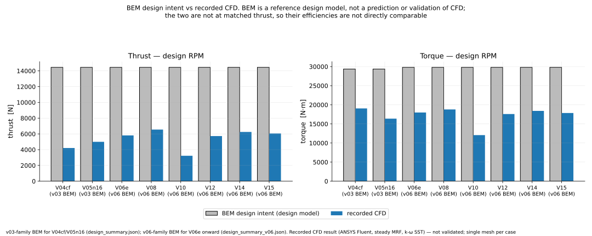
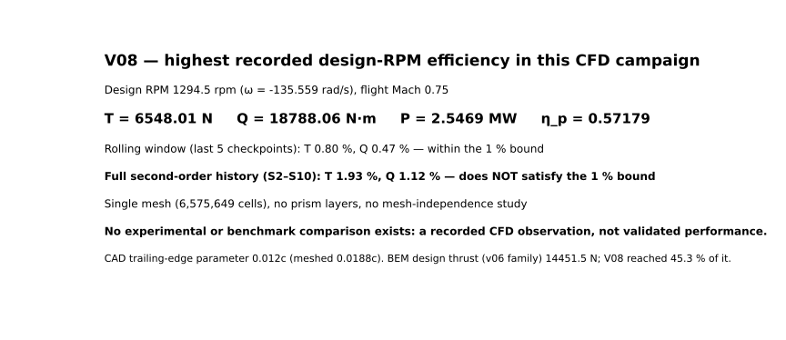

# Open-Fan Rotor — First-Principles Design and CFD Investigation

*16-blade rotor assembly (PRIME blades on the structural root modules and carrier), rendered from the CAD model.*

I designed a 16-blade swept open-fan (unducted) rotor from first principles and developed it as scripted,
gate-checked CAD. I then investigated its aerodynamics with a controlled campaign of 360° ANSYS Fluent
simulations. The campaign found a geometry construction error, corrected it, and then tested one hypothesis
at a time about why the rotor fell short of its design efficiency.

This repository documents what was designed, what the CFD showed, what the experiments ruled in and out, and
what was **not** demonstrated.

**Status in one line.** The design and CAD are frozen as built, with known issues (§7, §13). The CFD campaign has 18
labelled case variants (V03–V16) plus one unlabelled +7 % RPM trial; ten produced a recorded result. The 0.75
propulsive-efficiency target was not reached. No result here is validated against experiment, and none is
mesh-independent.

**Review status.** This repository has not undergone independent external review.

---

## 1. Engineering objective

An open fan removes the nacelle, which improves propulsive efficiency but exposes the blade tips to a
supersonic relative flow even at moderate flight Mach numbers. Sweep, not a duct, becomes the main tool for
managing it. I set out to design a rotor around that constraint and then to find out, with CFD, how close a
first-principles design gets to its intended performance.

## 2. Design requirements

I defined the design point as an isolated rotor at **flight Mach 0.75, 10,668 m (35,000 ft) ISA**, with a
**3.5 m diameter** and a **rotational tip Mach of 0.80**. The rotor was sized by a non-dimensional thrust loading
**τ = 0.08** rather than an assumed aircraft thrust, because no specific aircraft was defined. That gives
**1294.5 rpm**, a **helical tip Mach of 1.0966** (supersonic in the blade frame) and a design thrust of
**14,451.5 N**. Details: [`design/`](design/).

## 3. First-principles aerodynamic design

- **Method:** actuator-disk sizing followed by an Adkins–Liebeck minimum-induced-loss blade-element design.
- **Blade count:** I treated it as an output. Counts of 14–18 pass the aspect-ratio and chord bounds, and I chose
  the smallest count within 0.5 % of the best efficiency among them: **16 blades**.
- **Sweep:** I defined the sweep law from a leading-edge-normal Mach limit of 0.78, giving **44.66° at the tip**.
  A later check against the built geometry showed that this simple sweep law over-credits the Mach relief (see §11).
- **Model outputs and checks:** the design model gives η = 0.8072 (0.7951 for the later v06 design family). Its
  seven internal closure checks pass, which shows the model is self-consistent, **not** that a real rotor reaches
  that efficiency. The BEM model is a reference design model throughout this repository, never a validation of
  the CFD.

## 4. Geometry development

- **Construction:** the blade is generated by Python scripts driving the SolidWorks API, from the design table,
  and checked by independent re-open gates.
- **First attempt (v01):** it failed its own geometry gate. The cause was diagnosed as faceted section profiles,
  and the profiles were replaced with smooth two-spline sections.
- **v02:** it passed its gate, but a later coordinate check showed the sweep had been built as axial rake
  (0.757 m) with the tip at 1.879 m instead of 1.75 m.
- **v03:** the corrected design master, **PRIME**, has circumferential sweep with 6 mm rake. It passes a 12-check
  gate. Those checks cover geometry only; aerodynamic correctness is outside their scope (see §7).
- **Structural assembly:** PRIME was carried into a natively mated 16-blade structural assembly (§13).

Every CFD case uses a separate CFD geometry, never PRIME itself, because PRIME's 0.006c trailing edge could not be
meshed (§11). V03 to V05n16 keep PRIME's v03-family design table (V05n16 changes the section family); from V06e on,
the CFD blade uses the v06-family design table, a BEM redesign built with the same generator scripts.

**Naming.** "v03" is used for three different things: the **v03 blade** (PRIME, the CAD design master), the
**v03 BEM design family** (V03 to V05n16; V06e onward use the v06 family), and **V03**, the first CFD *case* (a
Fluent run on a PRIME-derived blade). Case names are written V03 to V16 in prose and as lower-case tags (`v08`) in
file and folder names, so a lower-case tag inside `cfd_campaign/`, or in a `performance_result_*` or
`*_orthoquality` file name, is a CFD case. Elsewhere, "v02", "v03" or "v06" without a case context means a CAD or
design-table version (for example `openfan_blade_v03_G1_PRIME_VERIFIED` or `design_summary_v06.json`).

*PRIME, the v03 design master, as a single blade: circumferential sweep along the span, and twist from the root
section (lower right, seen almost edge-on in this view) to the broad tip.*

| Axial view | Side view |
|---|---|
|  |  |

## 5. Analytical / reference model

The BEM design (design intent) is compared against CFD only as a reference. The two are never at matched
thrust: the CFD cases reach 22–45 % of the design thrust. Their efficiencies are therefore not directly
comparable.

## 6. CFD method

- **Domain and physics:** a 360° annulus with all 16 blades; steady multiple-reference-frame rotation at
  |ω| = 135.559 rad/s; k-ω SST turbulence; ideal gas with Sutherland viscosity; pressure far-field at Mach 0.75.
- **Mesh:** about 6–7 million tetrahedral cells per case, with **no prism layers**.
- **Mesh-quality gate:** the first 4.0 M-cell mesh diverged. The cause was traced to degenerate surface triangles
  inherited from the CAD tessellation, and I rejected that mesh on measured quality. Mesh quality became a
  standing gate from then on.
- **Force extraction:** thrust and torque are taken from Fluent's force reports on the blade walls.
- **Convergence:** judged on thrust and torque, over a rolling window (last 5 checkpoints) and over the full
  second-order history, each against a 1 % bound.

Details: [`cfd_method/`](cfd_method/).

## 7. Initial CFD state and the camber-sign discovery

The first solution (V03) produced **net drag (T = −845.8 N)** at design RPM while absorbing shaft power. I
investigated why. The CFD showed essentially no axial induction and an incidence several degrees higher than
designed. A geometry check then showed that **the section camber had been built on the wrong side of the chord**
for the direction of rotation. That is a construction error, found by measuring the CAD surfaces, not by tuning.
Correcting one sign (V04cf) turned the drag state into positive thrust (4209.9 N at the last checkpoint; that case
never settled).

PRIME uses the same section-placement code, so the same camber-side error applies to the design master. PRIME has
not been modified; it remains the hash-identified record of the design as built.

## 8. Controlled CFD campaign

From the corrected geometry I changed one design feature at a time. Some features bundle more than one parameter,
so these are staged changes rather than strictly single-variable ones:

- the section family (**V05n16**: NACA 16-series thickness together with its mean line);
- the lift and chord schedule (**V06e**, a v06-family BEM redesign: lower design C_l at root and tip, more chord and
  a thinner root, changed together);
- the trailing-edge parameter (**V08**).

Each case was run on the same solver setup. For most runs, an efficiency prediction and falsification criteria
were recorded before the solve.

## 9. V08 reference result

> **V08 — highest recorded design-RPM efficiency in this CFD campaign:**
> T = 6548.01 N, Q = 18788.06 N·m, P = 2.5469 MW, η_p = 0.57179.
> **The case did not satisfy the strict full-history convergence criterion** (1.93 % / 1.12 % against a 1 %
> bound; the rolling window passes at 0.80 % / 0.47 %), **and no mesh-independence or physical-validation
> claim is made.**

V08 is the reference geometry for the experiments that follow. It is not presented as a best or optimised
design. Its CAD trailing edge is 0.012c, but the mesh resolved 0.0188c, so V08 tests a thinner aft section rather
than a 0.012c edge. Full record: [`cfd_campaign/v08_reference_case/`](cfd_campaign/v08_reference_case/CASE.md).

V08's own pre-registered prediction was only partly met. Efficiency came out 0.0018 above the predicted band
(0.545–0.570), but the prediction also required shaft torque to fall, and torque rose 4.45 % relative to V06e, so
that clause (the base-drag mechanism behind the trailing-edge change) was not met.

## 10. Controlled redesign experiments

Three controlled design experiments on V08, each changing one design feature, were run to completion. **Each missed
its pre-registered efficiency prediction.** None is a fully clean single-variable comparison: their meshes differ
from V08's (V10 +0.4 %, V12 +9.1 %, V15 −0.4 %), and the meshed trailing edges of V12 and V15 differ from V08's.

| Experiment | Change | Recorded η_p | What it showed | What it did not show |
|---|---|---|---|---|
| V10 | uniform de-pitch −1.77° | 0.43856 | thrust fell 51 %; the prediction failed | the proposed shock mechanism was **not tested** (sectional data were not exported) |
| V12 | sweep +6° | 0.53417 | below both pre-registered bands | not a clean single-variable result (mesh +9.1 %, different meshed trailing edge) |
| V15 | local root de-pitch | 0.55670 | the root loading got worse; the change was not local | the incidence correction the root needs is not established |

Two related investigations sit alongside these:

- **V14 (diagnostic):** a boundary-condition test on the V08 case (zero-shear hub walls). It showed that the hub
  boundary layer is not the cause of the root's negative loading in this model. It is not a design.
- **V11 (1000 rpm, OFF-DESIGN):** a separate investigation. The blade was re-twisted for 1000 rpm, and the case
  recorded η_p = 0.656. It is the only case that passes both convergence windows, but it is not comparable with
  the design-RPM cases.

## 11. Negative results and hypotheses that failed

- **Camber built on the wrong side of the chord (V03).** Found and corrected.
- **Hub boundary layer as the cause of the root loss.** Ruled out in this model (V14).
- **Uniform over-pitch as the cause of the efficiency gap.** The V10 prediction failed. The mechanism behind it
  was **not** tested.
- **More sweep as a fix at design RPM.** The V12 prediction failed, with confounds.
- **Root de-pitch as a fix for the root state.** The V15 prediction failed. The single local slope estimate is
  too limited to say what the root needs. The opposite-sign experiment (**V16**) was built and meshed, but it
  was **not solved and has no CFD result**.
- **Base-drag mechanism behind the V08 trailing-edge change.** V08's pre-registered torque-fall clause was not met
  (torque +4.45 % relative to V06e), although η ended slightly above its predicted band (§9).
- **PRIME's 0.006c trailing edge in CFD.** It could not be volume-meshed at either size floor tried (V09 at
  7.24 mm, V13 at 2.5 mm), and the 0.008c case diverged (V09b). CAD trailing-edge thickness and meshed thickness
  differ throughout the campaign.
- **Sweep-law Mach relief.** The leading-edge-normal Mach relief assumed in the design over-credits the relief
  for circumferential sweep; the analysed sections run above their own critical Mach at the design condition.

## 12. Numerical limitations

- There is no design-RPM full-history convergence and no mesh-independence study (one mesh per case; memory
  limited the domain to about 6–7 M cells).
- The residual drop is about 3 orders against the 4 required.
- There are no prism layers: blade y⁺ is a median of about 430–440 (node-based), above the range the wall
  treatment needs.
- No experimental or benchmark validation exists.

Everything is listed in [`LIMITATIONS.md`](LIMITATIONS.md).

## 13. Structural workstream

I also developed the structural side of the rotor as CAD: a root module, a 16-station central carrier and a
spinner shell. These form a natively mated assembly of **34 components with 99 mates**, all fully constrained.
Measured geometry: minimum blade-to-blade clearance **205.5 mm**, axial rake **6.1 mm**, blade-to-root gap
**0.000000 mm**.

I then directed **screening-level FEA** (ANSYS MAPDL) of the root and retention region. Stage 2, on the original
root region as first drawn, already gave a fillet peak of 815 MPa, above the **provisional** 300 MPa allowable
(Stage 1: about 770 MPa). The screening then concluded that the chosen retention geometry, a dovetail-type concept,
was **not viable as drawn** (Stage 15). The full-rotor model did **not close its global moment balance** (Stage 20).
None of this is structural validation. Details: [`structural/`](structural/).

| Rear view | Structure with the shell hidden |
|---|---|
|  |  |

*Root region with the spinner shell hidden: PRIME blade roots meeting the root-module collars on the carrier
rim. This is the original pad-and-spigot root of the locked CAD assembly. The later retention study replaced it
with a dovetail-type concept, which the screening FEA judged not viable as drawn
(see [`structural/`](structural/)).*

## 14. Reproducibility

`python reproducibility/verify_results.py` recomputes shaft power, efficiency and both convergence windows for
every case from the recorded files. `python figures/src/make_figures.py` regenerates the plots. What can and
cannot be reproduced from this repository (the meshes are too large to publish) is listed in
[`reproducibility/REPRODUCE.md`](reproducibility/REPRODUCE.md).

## 15. Current status

| Question | Answer |
|---|---|
| Design and CAD | frozen as built (a record of the design as built, not a final design); the camber-side error found through CFD is not corrected in PRIME, and the retention concept was judged not viable as drawn (§13) |
| CFD campaign | recorded: 10 cases with a result (3 diagnostics — V03, V04cf, V14; 1 off-design case — V11; 6 design-RPM observations and experiments); 8 labelled variants without a result, including 1 unrun experiment (V16), plus the unlabelled +7 % RPM trial, which never settled |
| Design optimisation | not performed — a few controlled single-feature experiments only |
| CFD validation | not performed |
| Structural validation | not performed — screening FEA only |
| Experimental validation | not performed |
| Independent external review | not performed |
| 0.75 efficiency target | not reached (highest recorded design-RPM value 0.572) |

---

**Repository map:** [`RESULTS.md`](RESULTS.md) (all numbers) · [`LIMITATIONS.md`](LIMITATIONS.md) ·
[`EVIDENCE_INDEX.md`](EVIDENCE_INDEX.md) (where each claim comes from) · [`design/`](design/) · [`cad/`](cad/) ·
[`cfd_method/`](cfd_method/) · [`cfd_campaign/`](cfd_campaign/) · [`structural/`](structural/) ·
[`figures/`](figures/) · [`reports/`](reports/) · [`reproducibility/`](reproducibility/) ·
[`history/`](history/) (superseded and failed work, kept for the record).

Project, requirements, design decisions, investigation and conclusions by **Tanish Shetty**.
Tools: Python (NumPy, SciPy, Matplotlib), SolidWorks 2026 API, ANSYS Fluent 2025 R1, ANSYS MAPDL 2025 R1.
Code is MIT-licensed; CAD, drawings, figures and data are covered by [`ASSET_NOTICE.md`](ASSET_NOTICE.md).
