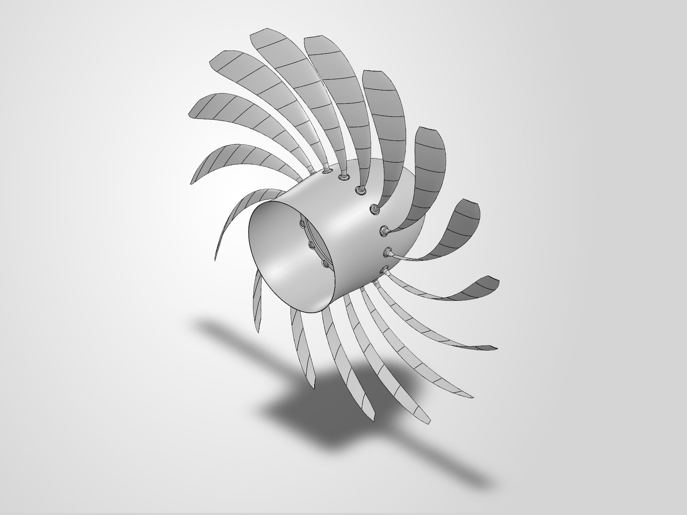
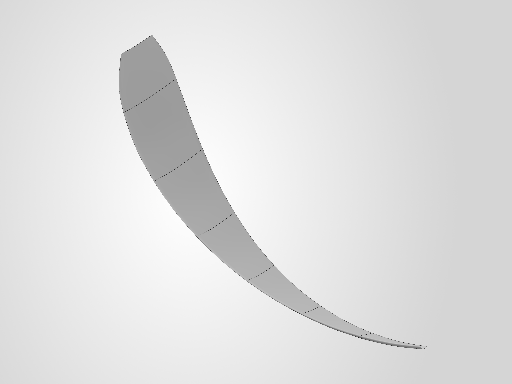
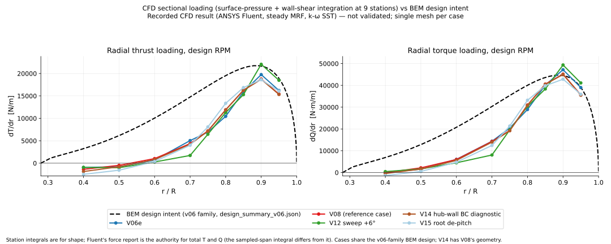

# Open-Fan Rotor

A 16-blade swept open-fan (unducted) rotor designed for Mach 0.75 cruise at 35,000 ft. The project runs from a
blade-element design through scripted SolidWorks CAD to a 360° CFD campaign in ANSYS Fluent. The first CFD run
exposed a camber error in the built blade. After it was corrected, a series of design changes tested how close
the rotor could get to its 0.75 propulsive-efficiency target. The highest design-RPM efficiency reached was
η_p = 0.572 (case V08).

## Design

| | |
|---|---|
| Design point | Mach 0.75, 10,668 m (35,000 ft) ISA, isolated rotor |
| Diameter / speed | 3.5 m; 1294.5 rpm (rotational tip Mach 0.80, helical tip Mach 1.0966) |
| Design thrust | 14,451.5 N, from a thrust loading τ = 0.08 |
| Method | actuator-disk sizing + Adkins–Liebeck minimum-induced-loss blade design |
| Blades | 16, chosen from a blade-count trade |
| Sweep | circumferential, 44.66° at the tip |

*PRIME, the design master blade: circumferential sweep along the span and twist from the root (lower right) to
the tip.*

The blade is generated from the design table by Python scripts driving the SolidWorks API. These are the designs
that matter in the CFD campaign:

| Design | What it is |
|---|---|
| **PRIME** | the v03 design master; its 0.006c trailing edge was too thin to mesh, so the CFD used the variants below |
| **V04cf** | PRIME's design with the camber sign corrected; trailing edge thickened to 0.020c for meshing |
| **V05n16** | NACA 16-series sections in place of NACA 4-digit |
| **V06e** | v06 BEM redesign: design C_l 0.70/0.40 → 0.45/0.26 (root/tip), more chord, root t/c 0.20 → 0.12 |
| **V08** | V06e with the trailing-edge parameter reduced to 0.012c (meshed as 0.0188c) |

## Key results

V08 is the reference case and has the highest recorded design-RPM efficiency in this CFD campaign, at
1294.5 rpm and Mach 0.75.

| Thrust | Torque | Shaft power | η_p |
|---:|---:|---:|---:|
| 6548.01 N | 18788.06 N·m | 2.5469 MW | 0.57179 |

- V08 produced about 45 % of the 14,451.5 N design-thrust value; the 0.75 efficiency target was not reached.
- Thrust and torque vary by 1.93 % / 1.12 % over the full second-order history, against a 1 % convergence
  criterion; over the last five checkpoints the variation is 0.80 % / 0.47 %.
- Each case uses a single mesh without prism layers. Mesh independence and experimental validation were not
  assessed.

Results for every case are in [`RESULTS.md`](RESULTS.md).

## What changed

The first run, V03, gave net drag (T = −845.8 N) while absorbing shaft power. Measuring the built blade showed
that the section camber was on the wrong side of the chord for the direction of rotation. Flipping it (V04cf)
gave positive thrust: 4209.9 N at the last checkpoint, although that run never settled. PRIME itself still
carries the error; it is retained unchanged as the record of the built design.

From the corrected blade, the section family was changed first (V05n16), then the BEM loading and chord
distribution (V06e), and finally the trailing-edge parameter (V08). V06e changes several parameters at
once, so these are staged design iterations rather than one-parameter experiments.

Three changes were then tested around V08: a uniform de-pitch (V10), 6° more sweep (V12) and a local root
de-pitch (V15). All three lowered efficiency and missed the predictions written before each run. A hub boundary-condition test (V14)
showed that the negative loading near the root does not come from the hub boundary layer in this model. The
loading plots show the pattern: the outer span gets close to the design loading, while the inner half stays well
below it.

The structural side of the rotor, with root modules, a 16-station carrier and a spinner shell, was built as a
fully mated CAD assembly, and the blade retention was checked with screening FEA in ANSYS MAPDL.

## More detail

| | |
|---|---|
| [`design/`](design/) | design point, BEM method, blade-count trade, the two design families |
| [`cad/`](cad/) | how PRIME was built, the CFD geometries, CAD vs meshed trailing edge, naming |
| [`cfd_method/`](cfd_method/) | solver setup, mesh, boundary conditions, convergence criteria |
| [`cfd_campaign/`](cfd_campaign/) | the campaign case by case, including what did not work |
| [`RESULTS.md`](RESULTS.md) | every recorded CFD result, including diagnostic and off-design cases |
| [`LIMITATIONS.md`](LIMITATIONS.md) | numerical and modelling limitations |
| [`structural/`](structural/) | structural assembly and screening FEA |
| [`reproducibility/`](reproducibility/REPRODUCE.md) | what can be re-run from this repository |
| [`EVIDENCE_INDEX.md`](EVIDENCE_INDEX.md) | where each number and claim comes from |
| [`figures/`](figures/) | all figures and their source data |
| [`reports/`](reports/) | lessons learned |
| [`history/`](history/) | superseded geometry, old drawings and cases without a result |

This repository has not undergone independent external review.

Project and analysis by **Tanish Shetty**. Tools: Python (NumPy, SciPy, Matplotlib), SolidWorks 2026 API,
ANSYS Fluent 2025 R1, ANSYS MAPDL 2025 R1. Code is MIT-licensed. CAD, drawings, figures and data are covered by
[`ASSET_NOTICE.md`](ASSET_NOTICE.md).
