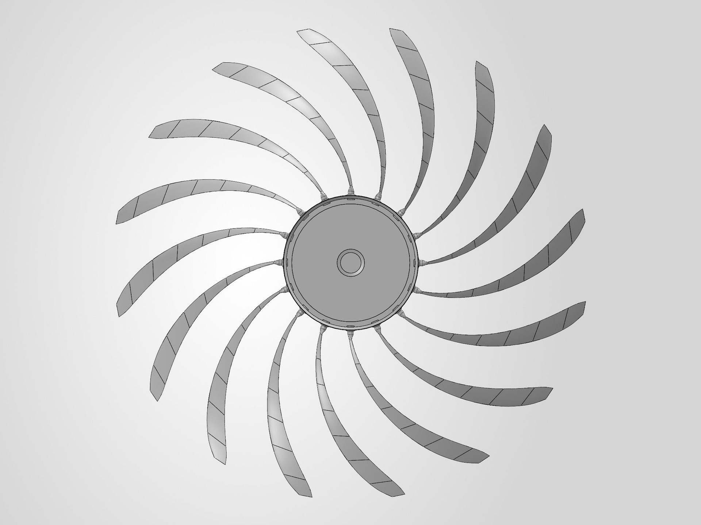
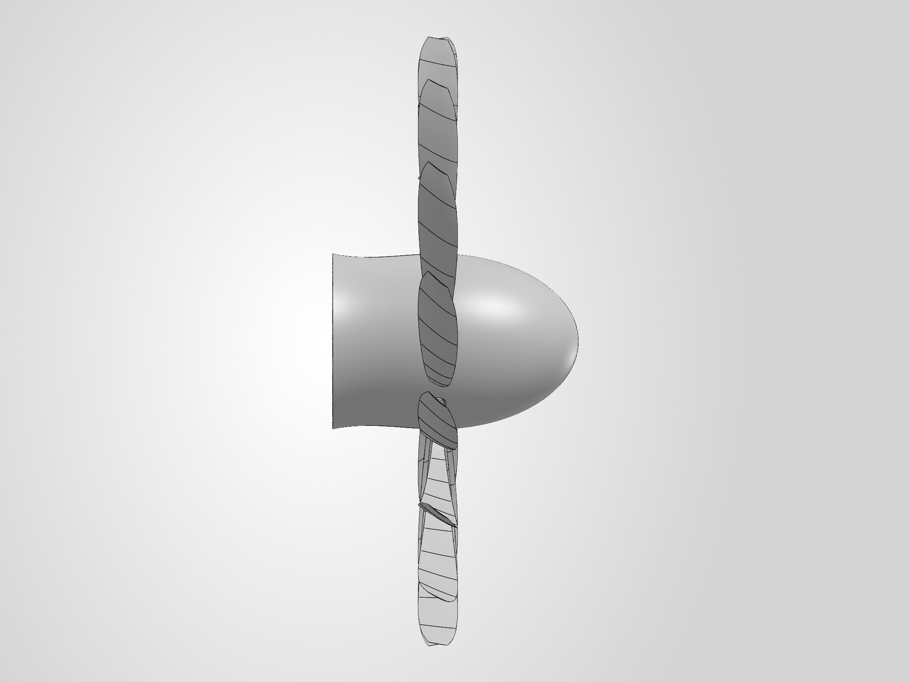

# CAD and geometry

## How the blade was built

The blade is generated from the BEM design table (`design/results/`) by Python scripts that drive the SolidWorks
API. After each build, a separate script re-opens the part and checks it against the design.

- **v01** failed its own geometry check. The cause was faceted section profiles, which were replaced with smooth
  two-spline sections.
- **v02** passed its check, but a later coordinate check showed the sweep had been built as 0.757 m of axial
  rake, with the tip at 1.879 m instead of 1.75 m. It is kept in `history/superseded_geometry/`.
- **v03 (PRIME)** builds the sweep circumferentially, with 6 mm of rake. It is the design master.

## PRIME

PRIME is `openfan_blade_v03_G1_PRIME_VERIFIED.SLDPRT`, built by `scripts/blade_geometry_v03.py`.

| | |
|---|---|
| SHA-256 | `f5d54c78d1596cdd4fd3df130d34287fe25768e99919c7a82be7b751ab17aeca` |
| Geometry check | 12 of 12 checks passed, before saving and after re-opening (`structural/verification/blade_v03_G1_PRIME_verification.json`) |
| "VERIFIED" in the name | refers to that geometry check: body count, validity, volume, true radius, axial rake, sweep and save/re-open. It says nothing about aerodynamic or structural performance. |
| Known issue | the section camber is on the wrong side of the chord for the direction of rotation. The CFD found it (V03); PRIME uses the same section-placement code. PRIME is retained unchanged as the record of the built design. |

The native SolidWorks file is not included; the hash above identifies it.

| Axial view | Side view |
|---|---|
|  |  |

## CFD geometries (`cfd_derivatives/`)

The CFD never used PRIME directly: its 0.006c trailing edge could not be meshed. Each case used its own geometry,
built by the same generator scripts. V03 to V05n16 use PRIME's v03 design table (V05n16 changes the section
family); V06e onward use the v06 design table. The STEP files are the exported geometries.

| File | Case(s) | Change from its parent |
|---|---|---|
| `openfan_blade_v03_CFD_SINGLELOFT.step` | V03 | PRIME with the trailing edge thickened to 0.020c (camber error still present) |
| `openfan_blade_v04_CFD_CAMBERFIX_SINGLELOFT.step` | V04cf | camber sign corrected |
| `openfan_blade_v05_CFD_NACA16_SINGLELOFT.step` | V05n16 | NACA 16-series sections |
| `openfan_blade_v06_CFD_SINGLELOFT.step` | V06, V06c, V06e | v06 BEM design (lower C_l, thinner root) |
| `openfan_blade_v08_CFD_SINGLELOFT.step` | V08, V14 | trailing-edge parameter 0.012c |
| `openfan_blade_v09_CFD_SINGLELOFT.step` | V09, V13 | trailing-edge parameter 0.006c (PRIME's value); could not be meshed |
| `openfan_blade_v10_CFD_SINGLELOFT.step` | V10 | uniform de-pitch −1.77° |
| `openfan_blade_v11_CFD_SINGLELOFT.step` | V11 (1000 rpm, off-design) | re-twisted for 1000 rpm |
| `openfan_blade_v12_CFD_SINGLELOFT.step` | V12 | sweep +6° |
| `openfan_blade_v15_CFD_SINGLELOFT.step` | V15 | root de-pitch −2.40° → 0 at r/R 0.55 |
| `openfan_blade_v16_CFD_SINGLELOFT.step` | V16 (not solved) | root re-pitch +2.40° → 0 at r/R 0.55 |

## Trailing edge: CAD value vs meshed value

The mesher did not resolve the trailing-edge thickness set in CAD. The meshed thickness was measured from the
blade-surface mesh (outboard mean, r/R ≥ 0.70). The measurements are in `cfd_campaign/<case>/te_thickness_*.json`.

| CAD parameter | Cases | Meshed thickness | Mesh | Solution |
|---|---|---|---|---|
| 0.020c | V03, V04cf, V05n16, V06e | 0.0200c (measured for V06e only) | generated | results |
| 0.016c | V08b | — | import failed | none |
| 0.012c | V08, V10, V11, V12, V14, V15, V16 | V08 0.0188c · V11 0.0182c · V12 0.0212c · V15 0.0161c · not measured for V10 (its own mesh, 6,603,468 cells against V08's 6,575,649), V14 (the V08 mesh itself) and V16 (meshed, not solved) | generated | results (V16 not solved) |
| 0.008c | V09b | not measured | generated | solve diverged |
| 0.006c (PRIME) | V09, V13 | — | failed at 7.24 mm and at 2.5 mm size floors | none |

When a result is labelled with a CAD trailing-edge value, read it together with the meshed value.

## Naming

"v03" means three different things in this repository:
- the **v03 blade** (PRIME);
- the **v03 BEM design family**, used by V03 to V05n16 (V06e onward use the v06 family);
- **V03**, the first CFD case.

In prose, CFD cases are written V03 to V16. File and folder names use lower-case tags (`v08`). So a lower-case
tag inside `cfd_campaign/`, or in a `performance_result_*` or `*_orthoquality` file name, is a CFD case.
Elsewhere, "v02", "v03" or "v06" on its own means a CAD or design-table version, as in
`openfan_blade_v03_G1_PRIME_VERIFIED` or `design_summary_v06.json`.

## Scripts (`scripts/`)

`blade_geometry.py` and `blade_geometry_v03.py` generate the section coordinates that the CAD build uses. The
SolidWorks build and check scripts for the structural assembly are in `structural/scripts/`. They need
SolidWorks 2026 to run.
