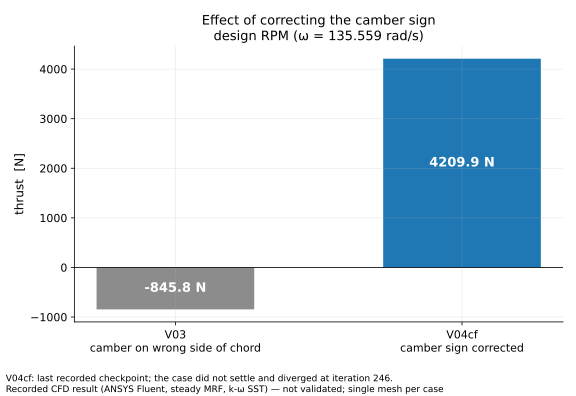
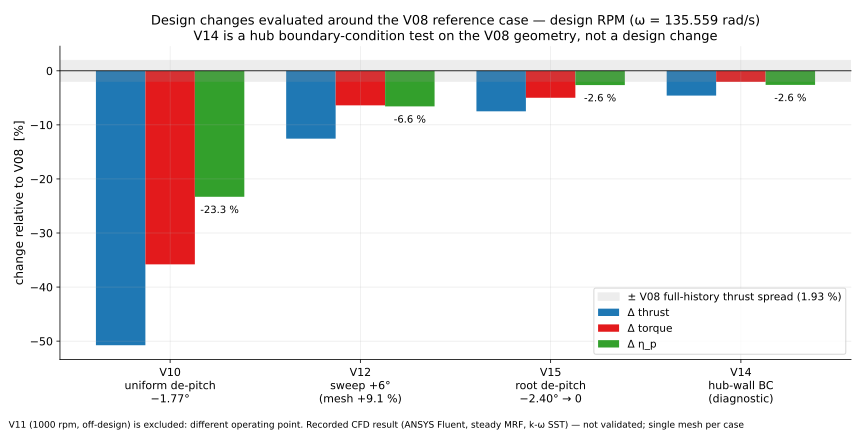

# CFD campaign

The campaign covers 18 labelled case variants (V03–V16) plus one unlabelled +7 % RPM trial. Ten produced a
result: six design-RPM cases, three diagnostics (V03, V04cf, V14) and one off-design case (V11). The other eight
labelled variants and the RPM trial did not produce a result; they are listed in
[`../RESULTS.md`](../RESULTS.md) §4 and [`../history/no_result_cases/`](../history/no_result_cases/). Setup:
[`../cfd_method/`](../cfd_method/). Numbers: [`../RESULTS.md`](../RESULTS.md).

| Folder | Case | Operating point | Role |
|---|---|---|---|
| [`v03_diagnostic_drag_state/`](v03_diagnostic_drag_state/CASE.md) | V03 | design RPM | diagnostic (net drag) |
| [`v04cf_camber_corrected/`](v04cf_camber_corrected/CASE.md) | V04cf | design RPM | diagnostic (unsettled) |
| [`v05n16_naca16_sections/`](v05n16_naca16_sections/CASE.md) | V05n16 | design RPM | design iteration |
| [`v06e_cl_chord_schedule/`](v06e_cl_chord_schedule/CASE.md) | V06e | design RPM | design iteration |
| [`v08_reference_case/`](v08_reference_case/CASE.md) | V08 | design RPM | reference case |
| [`v10_uniform_depitch/`](v10_uniform_depitch/CASE.md) | V10 | design RPM | experiment on V08 |
| [`v11_1000rpm_offdesign/`](v11_1000rpm_offdesign/CASE.md) | V11 | **1000 rpm, off-design** | separate investigation |
| [`v12_sweep_plus6deg/`](v12_sweep_plus6deg/CASE.md) | V12 | design RPM | experiment on V08 |
| [`v14_hub_bc_diagnostic/`](v14_hub_bc_diagnostic/CASE.md) | V14 | design RPM | boundary-condition diagnostic |
| [`v15_root_depitch/`](v15_root_depitch/CASE.md) | V15 | design RPM | experiment on V08 |

Each folder has a `CASE.md` with the change, the prediction written before the run, the outcome and notes.

## How the campaign went

**Camber error (V03 → V04cf).** The first solution, V03, produced net drag (T = −845.8 N) at design RPM while
still absorbing shaft power. The flow showed almost no axial induction, and the incidence was several degrees
above design. Measuring the built blade surfaces showed that the section camber had been placed on the wrong
side of the chord for the direction of rotation. Correcting that one sign (V04cf) gave positive thrust: 4209.9 N
at the last checkpoint. V04cf diverged at iteration 246, so the value is not settled. PRIME uses the same
section-placement code and carries the same error.

**Design iterations (V05n16 → V06e → V08).** From the corrected blade, three things were changed in turn:

- the section family to NACA 16-series, with thickness and mean line together (V05n16);
- the BEM loading and chord distribution: lower design C_l at root and tip, more chord and a thinner root, all
  changed together (V06e);
- the trailing-edge parameter, from 0.020c to 0.012c (V08).

V06e changes several parameters at once, so these are staged design iterations rather than one-parameter
experiments. V08 gave the highest design-RPM efficiency, η_p = 0.572. Its CAD trailing edge is 0.012c, but the
mesh resolved 0.0188c, so V08 really tests a thinner aft section rather than a 0.012c edge. The V08
prediction was only partly met. Efficiency came out 0.0018 above the predicted band (0.545–0.570), but the
prediction also expected shaft torque to fall, since the change was meant to cut base drag, and torque rose
4.45 % relative to V06e.

**Experiments around V08 (V10, V12, V15).** Each of these changes one design feature of V08. Each run missed
the efficiency prediction written beforehand. The meshes also differ from V08's (V10 +0.4 %, V12 +9.1 %,
V15 −0.4 % in cell count), and the meshed trailing edges of V12 and V15 differ as well. So none of the three is
a perfectly clean one-variable comparison.

| Case | Change | η_p | What it showed | What it did not show |
|---|---|---:|---|---|
| V10 | uniform de-pitch −1.77° | 0.43856 | thrust fell 51 % | the proposed shock mechanism: sectional data were not exported |
| V12 | sweep +6° | 0.53417 | efficiency below both predicted bands | a clean sweep effect (mesh +9.1 %, different meshed trailing edge) |
| V15 | root de-pitch −2.40° → 0 at r/R 0.55 | 0.55670 | root loading got worse, and the change also affected loading outboard | what incidence correction the root actually needs |

*Change in thrust, torque and efficiency relative to V08, against V08's own full-history thrust spread.*

**Hub boundary layer (V14).** V14 re-runs the V08 case with zero-shear hub walls, with the same geometry and
mesh. The negative root loading got deeper (dT/dr at r/R 0.40 from −1369 to −1858 N/m), so the hub boundary
layer is not what causes it in this model. V14 is a diagnostic, not a design.

**Off-design (V11).** A blade re-twisted for 1000 rpm reached η_p = 0.656. It is the only case that passes both
convergence windows. Speed and twist changed together, so it cannot be compared directly with the design-RPM
cases.

## What did not work

- **More sweep (V12)** and **root de-pitch (V15)** both lowered efficiency. The opposite-sign root change (V16)
  was built and meshed, but it was not solved.
- **Uniform de-pitch (V10)** cut thrust by half. The mechanism behind the prediction was never tested.
- **PRIME's 0.006c trailing edge** could not be volume-meshed at either size floor tried (V09 at 7.24 mm, V13 at
  2.5 mm). A 0.008c version meshed, but its solve diverged (V09b).
- **The design sweep law** over-credits the Mach relief for circumferential sweep. The analysed sections run
  above their own critical Mach at the design condition.

## Files in the case folders

- **Recorded** files are copied byte-for-byte from the project records. That includes the result files,
  loading, polars, trailing-edge and mesh-quality records.
- **Derived** files were produced for this repository from recorded data:
  - `residuals_*.csv`, from the solver logs;
  - `blade_yplus_node_statistics_*.json`, from the blade-surface exports;
  - `campaign_summary.json`, from `reproducibility/verify_results.py`.

  The scripts that produced the residual and y⁺ files are not included.

A few recorded fields need care:

- The stored `rpm` field is stale in some files. V11's reads 1294.49, while ω gives 1000 rpm.
- `settled_within_1pct` refers to the rolling window only.
- The polars for V04cf, V05n16 and V06e were computed on a zero-induction basis that was later found to be
  wrong. They were not regenerated.
