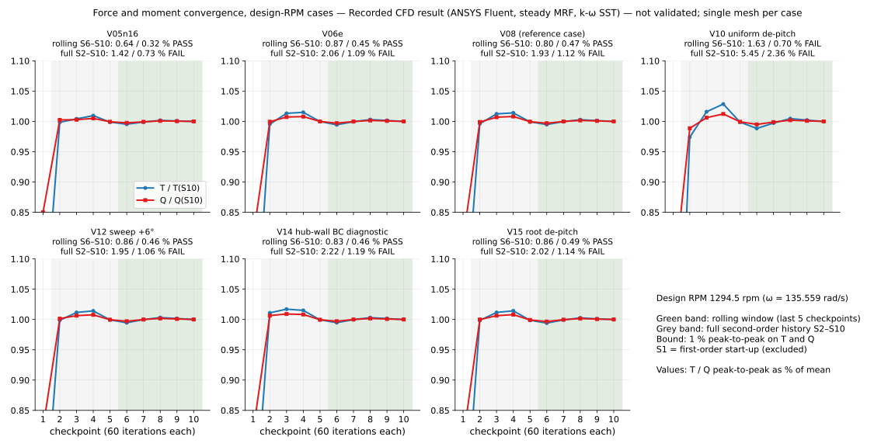

# CFD method

This setup applies to every case in `cfd_campaign/` unless a case page says otherwise. The Fluent settings are in
the journal templates in `journals/`, which are the V08 setup and solve journals with absolute file paths removed.
The journals for V05n16, V06e, V09b, V10, V12 and V15 are identical to V08's apart from the case tag and the
solver-assigned zone ID. V11 differs only in ω. V14 re-reads the V08 case and changes only the hub-wall condition
(`setup_v14_hub_bc_template.jou`).

## Setup

| Item | Setting |
|---|---|
| Solver | ANSYS Fluent 2025 R1, 3-D, steady (pressure-velocity coupling scheme not set in the journals; solver default) |
| Domain | 360° annulus containing all 16 blades; far field to r = 7 m, z = −7 … +10.5 m |
| Frame | multiple reference frame: rotating cylindrical zone r ≤ 2.0 m, z = −1 … +1 m; outer zone stationary |
| Rotation | ω = −135.559045147 rad/s about +z in the case journals (V04cf onward), i.e. 1294.49 rpm about −z; V11: −104.719755 rad/s (1000 rpm) |
| Turbulence | k-ω SST |
| Fluid | air, ideal gas, three-coefficient Sutherland viscosity, energy equation on |
| Inlet / far field | pressure far-field, p = 23,842.27 Pa, T = 218.808 K, Mach 0.75 along +z |
| Outlet | pressure outlet, 23,842.27 Pa |
| Walls | blade and hub no-slip (V14: hub zero-shear) |
| Discretisation | 60 first-order iterations, then second order |
| Schedule | 60 first-order + 9 × 60 second-order iterations requested; force and moment reported at every 60-iteration checkpoint (S1–S10). Fluent's default residual stop ended some runs a few iterations early. |
| Mesh | Fluent Meshing watertight workflow, tetrahedral, size 7.24 mm – 0.5 m, growth 1.2, curvature and proximity sizing; **no prism layers**; about 6–7 M cells |

## Mesh quality

The first 4.0 M-cell mesh diverged in three solves. The cause was degenerate surface triangles carried over from
the CAD tessellation (minimum orthogonal quality of zero), so that mesh was rejected. From then on every
mesh was checked before it was solved. The per-case quality records are in
`cfd_campaign/<case>/openfan_*_vol_orthoquality.json`.

## Forces and efficiency

- Thrust T = −F_z and torque Q = M_z come from Fluent's force and moment reports on the blade walls. Hub walls
  are excluded.
- Shaft power is P = Q·|ω|, and propulsive efficiency is η_p = T·V0/P with V0 = 222.40 m/s.
- η_p is only reported when T > 0 and P > 0. In a windmill or drag state the ratio of two negative numbers can
  look like a plausible efficiency.
- Two separately written parsers (`postprocessing/compute_performance.py` and
  `postprocessing/independent_extract.py`) give identical values for the cases where both were run.

## Convergence

Convergence is judged on thrust and torque over two windows:

| Window | Definition |
|---|---|
| Rolling | peak-to-peak / mean of T and Q over the last 5 checkpoints; 1 % limit |
| Full history | peak-to-peak / mean of T and Q over S2–S10 (all second-order checkpoints); 1 % limit |

Before any CFD was run, a stricter target (G2) was set:
- at least three refined meshes, with < 2 % change between the two finest;
- residuals down at least 4 orders;
- T and Q stationary over the final 500+ iterations;
- y⁺ within the range the wall treatment needs.

No design-RPM case met it. There is one mesh per case, residuals drop about 3 orders, the full-history spread is above
1 % in every case, and y⁺ is too high without prism layers. The original plan was to report no
performance numbers unless G2 was met; instead, the results are reported with their convergence numbers beside
each one ([`../RESULTS.md`](../RESULTS.md)).

## Post-processing scripts (`postprocessing/`)

| Script | Purpose | Input (not published) |
|---|---|---|
| `compute_performance.py` (+ `bem_reference.py`, `case_omega.py`) | T, Q, P, η from the Fluent transcript; per-family BEM reference; per-case ω | Fluent transcript file (`.trn`) |
| `independent_extract.py` | a second, separately written parser of the force reports | Fluent transcript file (`.trn`) |
| `convergence_character.py` | window statistics and trend test | Fluent transcript file (`.trn`) |
| `measure_te_thickness.py` | meshed trailing-edge thickness from the blade-surface export | blade-surface CSV |

These scripts show how the recorded files were produced. Their inputs, the Fluent transcripts and field exports,
are too large to include (see [`../reproducibility/REPRODUCE.md`](../reproducibility/REPRODUCE.md)). From the
recorded JSON files, `reproducibility/verify_results.py` recomputes shaft power, efficiency, rpm and both
convergence windows. Thrust, torque, mesh counts and the other values are the recorded inputs.

The scripts that produced the sectional polars, blade-loading integrals, velocity triangles, y⁺ statistics,
residual histories and span accounting are not included. Code comments refer to some of them (for example
`sectional_polar_from_cfd.py` and `analyse_blade_loading.py`). Their outputs are in `cfd_campaign/`, unchanged,
but cannot be regenerated from this repository.
