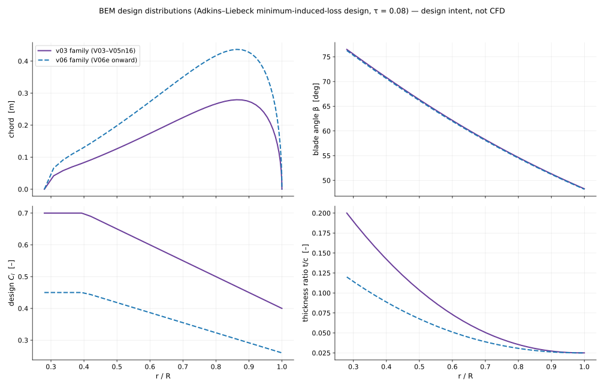

# First-principles design (BEM)

**What this is:** the analytical design model that sized the rotor. It is a **reference / design model**. It is
not a CFD validation, an experimental validation, or a prediction of the CFD results.

## Design point (defined requirements)

| Quantity | Value | Basis |
|---|---|---|
| Flight condition | Mach 0.75, 10,668 m (35,000 ft) ISA | requirement |
| Diameter | 3.5 m | design decision |
| Rotational tip Mach | 0.80 | requirement → 1294.49 rpm, ω = 135.559 rad/s |
| Helical tip Mach | 1.0966 | calculated, √(0.75² + 0.80²) |
| Thrust loading τ = T / (ρ A V0²) | 0.08 | design decision (no aircraft-level thrust requirement exists) |
| Design thrust | 14,451.5 N | output |

## Method

`openfan_design.py` implements actuator-disk sizing and an Adkins–Liebeck minimum-induced-loss blade-element
design with a Prandtl tip/hub loss factor, closed-form NACA 4-digit sections and a low-order section-drag
estimate. `run_phase1_design.py` runs the design and the blade-count trade.

- **Blade count.** Counts 14–18 pass the aspect-ratio and chord bounds (`results/blade_count_trade.csv`). I chose
  the smallest count within 0.5 % of the best efficiency among them, which gives **B = 16**. The 0.5 % threshold
  is a design decision.
- **Sweep.** Sweep follows from a leading-edge-normal Mach limit of 0.78 through cos Λ = 0.78 / M_helical, giving
  44.66° at the tip. **Limitation found later:** this flat-wing relation over-credits the relief for
  circumferential sweep, so the sections run above their own critical Mach.
- **Internal checks.** Seven closure checks pass, including a 41 → 81 station refinement (`gate_G0` and
  `station_independence` in `results/design_summary.json`). They show the model satisfies its own equations. They
  do not show that a real rotor reaches the modelled efficiency.

## Two design families — use the right one

| File | Family | Design C_l root / tip, root t/c | Torque | η (model) | Applies to |
|---|---|---|---|---|---|
| `results/design_summary.json` | v03 | 0.70 / 0.40, 0.20 | 29,372 N·m | 0.8072 | V03, V04cf, V05n16 |
| `results/design_summary_v06.json` (from `run_v06_design.py`) | v06 | 0.45 / 0.26, 0.12 | 29,818 N·m | 0.7951 | V06e, V08, V10, V12, V14, V15, V16 |
| `results/bem_at_v11_rpm.json` | v06 blade at 1000 rpm, matched thrust | — | 44,073 N·m | 0.6964 | a bound only; not a prediction of V11 |

Both families have the same design thrust (14,451.5 N). Comparing a CFD case with the other family's BEM values
would be wrong; every figure in this repository names its family.

