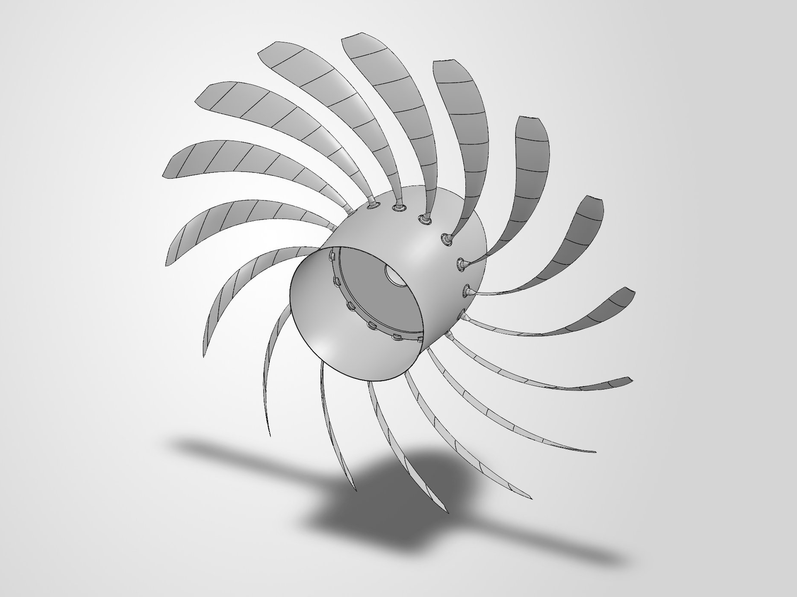
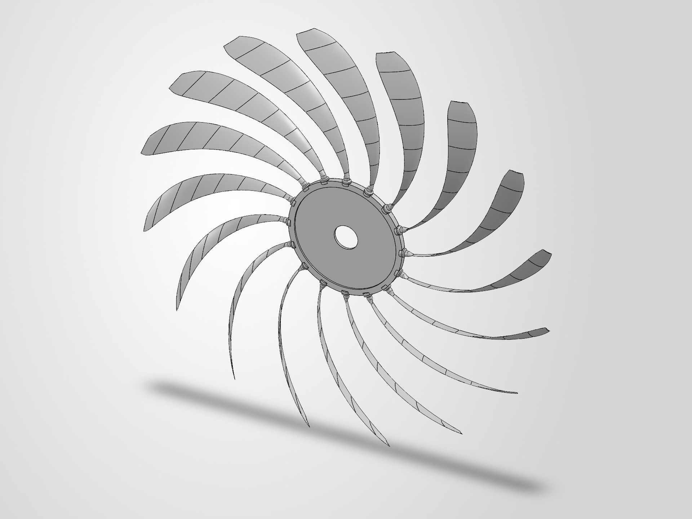
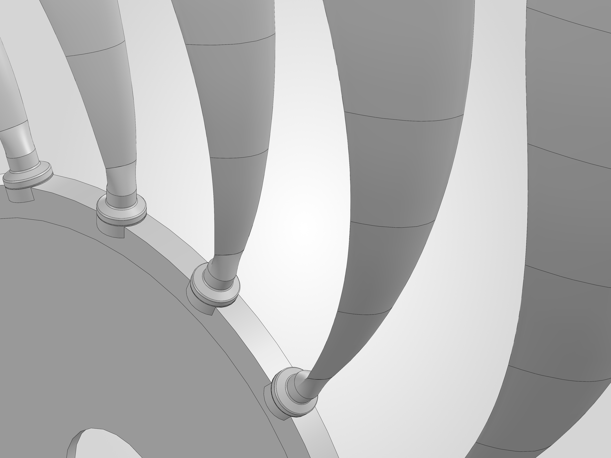

# Structural work

There are two parts: a complete CAD assembly of the rotor, and a set of screening-level FEA runs on the blade
root and retention.

## CAD assembly

The PRIME blade was carried into a 16-blade structural assembly:

- 16 root modules (shank, integral flange, bearing seat);
- a 16-station central carrier;
- a spinner shell with 16 cutouts, which is an aerodynamic fairing, not a load path.

The parts are natively mated in SolidWorks rather than placed by transforms. A re-open check records
(`verification/rotor_assembly_v02_final_verification.json`):

| Check | Value |
|---|---|
| components / mates | 34 / 99, all components fully constrained |
| blade pitch | 22.5° at every station |
| blade-to-root interface gap | 0.000000 m |
| minimum blade-to-blade surface distance | 0.2055 m (true surface distance) |
| root-to-tip axial rake | 0.00612 m |
| shell-to-carrier / shell-to-root clearance | 12.11 mm / 9.88 mm at all 16 stations |

Each component has its own check file in `verification/`. The PRIME blade check (12 of 12 geometry checks,
before saving and after re-opening) is in `verification/blade_v03_G1_PRIME_verification.json`.

The sizing of the shank, seat, carrier web and shell was preliminary closed-form work, so the assembly fixes the
geometry but says nothing about structural margins, fatigue, flutter or manufacturability. The native CAD files
are not included. The drawings made from them are in `history/drawings_2026-08/`.

| Rear view | Structure with the shell hidden |
|---|---|
|  |  |

*Root region with the spinner shell hidden: PRIME blade roots in the root-module collars on the carrier rim. This
is the original pad-and-spigot root of the CAD assembly. The later retention study replaced it with a
dovetail-type concept, which the screening FEA found not viable as drawn (Stage 15 below).*

## Screening FEA (ANSYS MAPDL 2025 R1)

After the CAD assembly, a sequence of screening analyses covered the blade root and retention. The stage
reports are identified by hash in `reproducibility/unpublished_evidence_register.json`.

| Stage | What it was | Solved? | Key result | Stage conclusion |
|---|---|---|---|---|
| 1 — root seat | local model of the root seat (solid of revolution) | yes, 10 runs | fillet peak ≈ 770 MPa, K_t 2.74 | screening only; it was not established that the design fails |
| 2 — 22.5° sector | carrier sector plus root module, sector boundary conditions | yes, converged series | fillet peak 815.27 MPa (last refinement step −0.43 %, within a 1 % criterion set beforehand) | peak exceeds a **provisional** 300 MPa allowable (ratio 0.368) |
| 3–14 | load definition, allowables, retention architecture options, CAD | no | decision records | — |
| 15 — Model A | the selected dovetail-type ("C7") retention, 22.5° sector with contact | yes, 14 converged load steps | flank fillet 2526–2537 MPa | **"the C7 geometry at the screening dimensions is not viable as drawn"** |
| 16–17 | failure diagnosis; revised retention CAD | no | — | redesign definition |
| 18 — Model A-R | revised retention, 20 load cases | yes | bending 347 → 665 MPa | governing stress **not mesh-converged**; a full-rotor model is required |
| 19 — mesh closure | refinement study | yes | intermediate fillet converged (−1.51 %); blade peak not converged (+8.46 %, contact-edge singularity) | partial mesh closure |
| 20 — Model C | full 360° rotor, 1,082,992 nodes | yes | axial force balance closes | **global moment balance does not close**; retention not closed |
| 21–23, 25, 27–28 | checks of the moment-balance problem and formulation options | no | missing moment localised to the bolt constraint pairs | open |
| 24, 26 | benchmarks on test blocks (7 solves on a 576-element block; coupling comparison) | yes | constraint and coupling behaviour | benchmarks only, not design results |

**Inputs.** The centrifugal load (163.3 kN in Stages 1–2, 168.71 kN from Stage 15) came from an earlier sizing
step. Bending moments were derived from the design loading. Material allowables were provisional. The stage 1
report does not name the aerodynamic dataset behind its moments.

**What it shows.** The retention region, as first drawn, is highly stressed. The first retention concept fails
its screening, and the full-rotor model has an unresolved moment-balance problem. The work does not give a factor
of safety against a sourced allowable, a fatigue life, or a working retention design.
